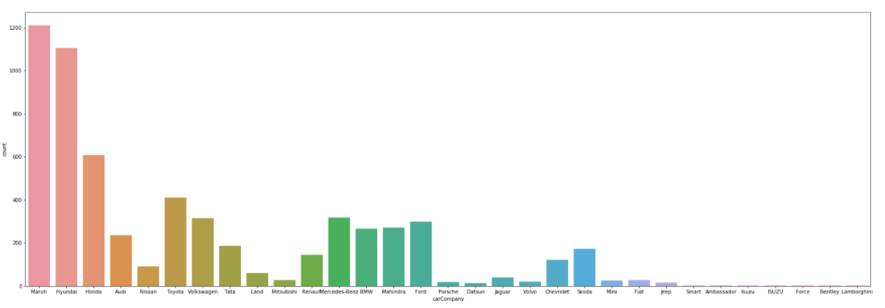
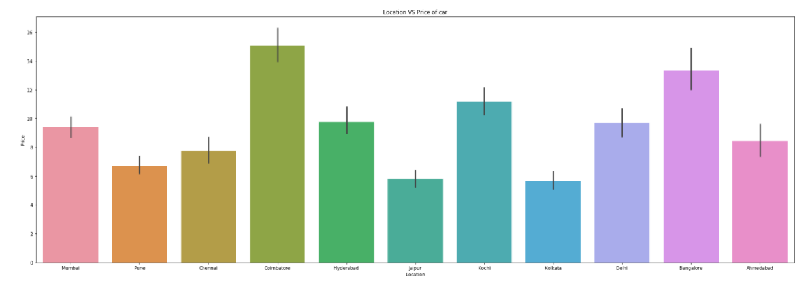
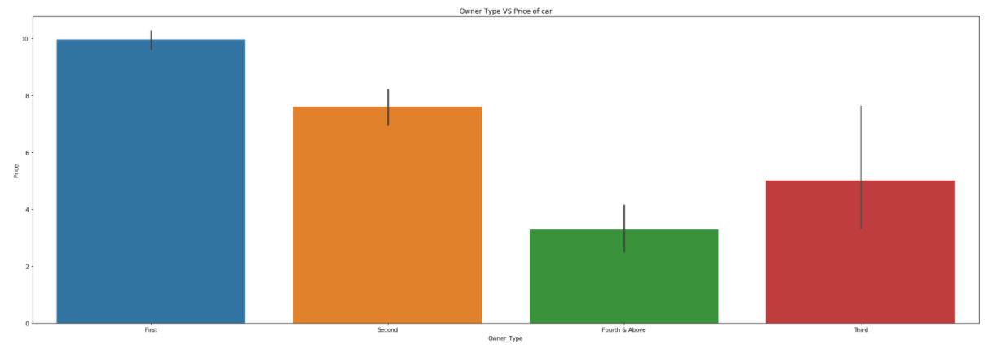
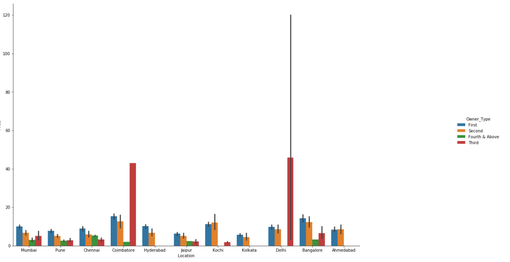
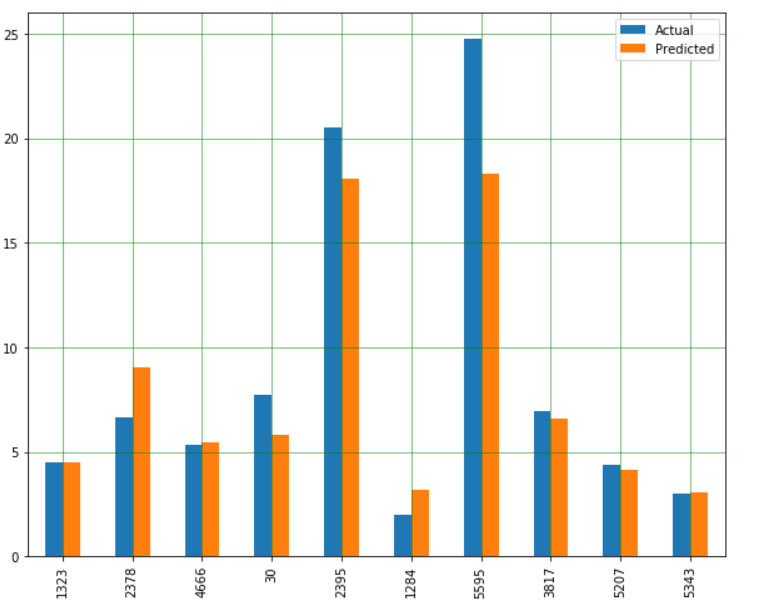

# Used-car-prices-prediction
# Overview:
 Having problems in deciding to buy a second-hand car 🚗?
 💡Well this analysis will help you decide which second-hand car to buy for the best price.

# Methodology: 
Taking used car data, preprocessing it and then using machine learning algorithm(s) to predict the best price.

😴 Feeling bored about this , well this is not just an eda on some data, anyone can visually see the difference in the prices. 

# Results:
 <h2>Which car company produces maximum cars?</h2>
 
 
 
 <h2> Which location gives maximum price of cars</h2>
 
 
 
 <h2> Price of cars according to owner type</h2>

<h2>Location wise distribution of owner_type of cars</h2>

<h2>Pridicted price vs Actual price</h2>

